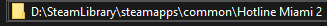
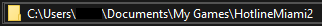

# Hotline Miami Mod Manager

- Introduction
- Installing
  - Finding your game and mods paths
  - Organizing your mods files
    - Creating a default mod

## Introduction

Hotline Miami Mod Manager is a user-friendly application designed to streamline the management of your Hotline Miami 2 mods, providing a quick and easy way to organize and switch between different mods of the game.

## Installing

To install Hotline Miami Mod Manager, download the appropriate program for your system [here: !TODO]. During installation, the program will generate configuration files, so it's recommended to keep the application within its own dedicated folder for seamless file management.

### Finding your game and mods path

Upon launching the application, you'll be prompted to input specific folder paths. This information is essential for the program to correctly copy music and mod files.

Game Path: Your game's folder. Normally would look something like this: D:\SteamLibrary\steamapps\common\Hotline Miami 2



Mods Path: The folder where HM2 expects the mods. Normally would look like this: C:\Users\cardosoOReis\Documents\My Games\HotlineMiami2



Next, you'll need to provide the path to the folder where you organize your mods.

### Organizing your mods files

First, if you don't already have a folder with your mods, create one. After that, give this folder's path to the program, and you will be able to use it.

You need to organize your folder in a simple, but specific way for the program to correctly find your mods and music. The folder structure will look like this:

```sh
my_mods
| - my_mod
|    | - music
|    |    | - music_file.wad
|    | - mods
|        | - mod_file_1.patchwad
|        | - mod_file_2.patchwad
```

First, we need to create a folder for the mod we want. Let's take [Don't Fear The Reefer](https://steamcommunity.com/sharedfiles/filedetails/?id=1121780991) as an example.

The mods name should be in [Snake Case](https://en.wikipedia.org/wiki/Snake_case) convention.

```sh
my_mods
| - dont_fear_the_reefer
```

This campaign has both a music and some mods. First, we create a folder with the name `music`, and add the campaign music to it.

```sh
my_mods
| - dont_fear_the_reefer
    | - music
        | - music_file.wad
```

> **_NOTE:_** The music folder **NEEDS** to have the name `music`, so the program can copy the music correctly. The music file name doesn't matter, as long as it is the **only** file in the folder.

After adding the music, we still need to add the mods files. We create a new folder called `mods`, where we will store this campaign mods'.

```sh
my_mods
| - dont_fear_the_reefer
    | - music
    |   | - dont_fear_the_reefer.wad
    | - mods
        | - pardo.patchwad
        | - score.patchwad
```

> **_NOTE:_** Like the music folder, the mods folder **NEEDS** to have the name `mods`, so the program can copy all the mods correctly.

If a campaign lacks either mods or music, you can omit the corresponding folder, and the program will still function correctly.

Using [Blessed Redux](https://steamcommunity.com/sharedfiles/filedetails/?id=907321341) as an example, it only has a music, not mods. So its folder structure can look like this:

```sh
my_mods
| - blessed_redux
    | - music
        | - blessed_redux.wad
```

### Creating a default mod

For the program to work properly, there should be a default Hotline Miami 2 folder, containing the game's original music. This is because the program needs a fallback music to use when you swap from a mod with a custom music to a mod without a custom music, otherwise the previous mod music would be in it's place.

For that, you should create a folder called `hotline_miami_2`, having the `music` folder, and the original music with it.
